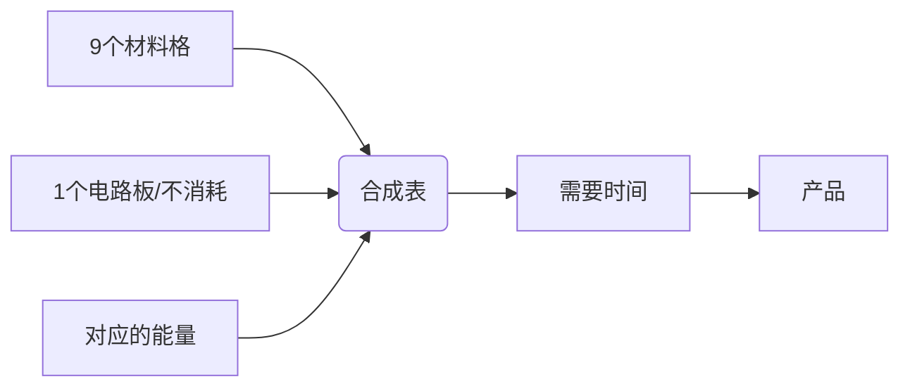
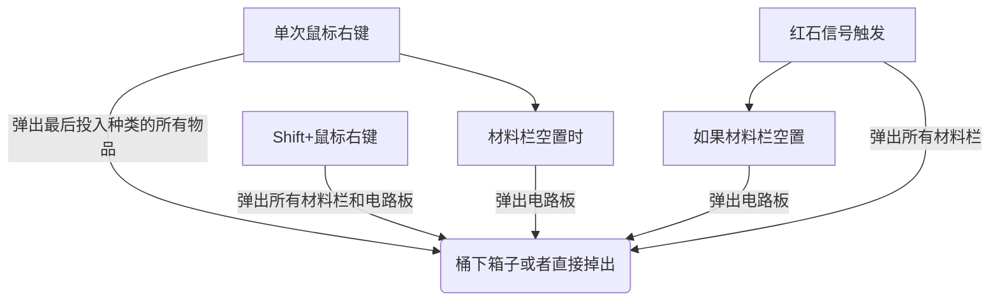
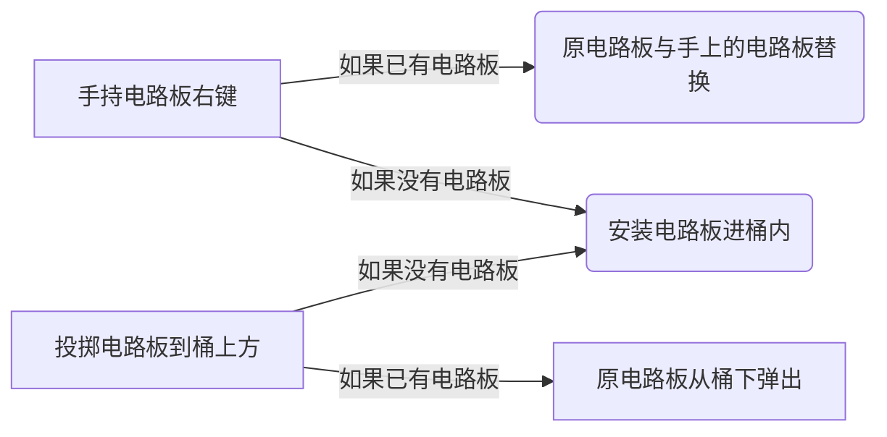
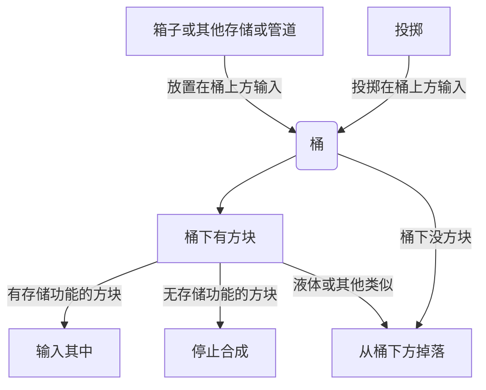

# 桶 Bruaket
A mod just hava bucket.  
一个**桶**mod  
Rua!

# 桶的功能 Function Of Bruaket
### 重要概念 Important point
1. 没有GUI
2. 代替合成台合成
### 合成 Crafting

1. 配方包含**9个材料格**和**一个电路板**以及**能量和时间**
2. 单次合成可以需求多个同种材料和生产多个产品
3. 支持RF，MANA
### 显示 Display
1. 在准心下方显示桶内合成状态
2. 九个物品框+一个电路板框+合成进度+成品
[可以先不做这个东西，交给waila或者the one probe]

### 弹出物品 Eject item
这是弹出材料仓内的物品，不是取出成品


### 电路板
用来区分合成表，虽然沿用格雷科技的叫法叫电路板，但是这里使用的物品是符咒（Talisman）。

### 物流 Logistics

感觉输出物品的功能可以完全做成一个模块重复使用，上面有多处使用输出物品。

### 其他 Other
1. 支持Waila
2. 支持The One Probe
3. 支持Crafttweaker注册合成表

```
推荐的代码框架展示:
桶.addRecipe(输出物品,输出数量,桶类型，电路板,能量种类,能量消耗量,合成表JSON);
桶.addRecipe(输出物品,输出数量,桶类型，电路板,能量种类,能量消耗量,
    {
    "物品名1-9": 数量
    }
);

数量之前没做出来
```
桶的种类数据：  
* Wooden
* Iron
* Livingwood
* Tinker
* Ender
# 物品与方块 Item And Block
### 方块
1. 木桶 Wooden Barrel
2. 铁桶 Iron Barrel
3. 活木桶 Livingwood Barrel
4. 地狱桶 Nether Barrel
5. 工匠桶 Tinker Barrel
6. 能源桶 Energistics Barrel
7. 末影桶 Ender Barrel
8. 桶样板终端 Barrel Pattern Terminal

### 物品
1. 石符咒 Stone Talisman
2. 火符咒 Fire Talisman
3. 木符咒 Wood Talisman
4. 金符咒 Iron Talisman
5. 水符咒 Water Talisman
6. 炎符咒 Ultra Flamma Talisman
7. 焱符咒 Maxima Flamma Talisman
8. 手提桶 Bucket 
9. 桶之种 Barrel Seed
10. 桶样板 Barrel Pattern 

# 物品功能
**木桶&铁桶&工匠**  
不消耗能量的合成桶  
木桶硬度：3  
铁桶&工匠桶硬度：6  
**活木桶**  
消耗mana的合成桶  
硬度：3  
**地狱桶**  
消耗能量代替熔炉的桶，放入不同符咒效果不同，可以消耗MANA  
硬度：10  
1. 火符咒：1个烧炼槽，单次烧制1个物品，功耗5RF/t，单次烧制耗时200Tick
2. 炎符咒：3个烧炼槽，单次烧制8个物品，功耗60RF/t，单次烧制耗时180Tick
3. 焱符咒：9个烧炼槽，单次烧制32个物品，功耗760RF/t，单次烧制耗时130tick
烧炼槽：一次能烧多少种不同的物品，也是储存物品的存储空间。  
在运行时使用发亮的贴图，不运行时使用不发亮的贴图  
如果能再给顶部增加火把的烟雾效果就更好了  

**能源桶**  
能接入AE网络，可执行除地狱桶外所有种类配方，如需要消耗能量则消耗1.5倍于原配方等比转换后的AE能量  
能量消耗计算：原配方能量的AE转换*倍率+固定增减值  
合成样板放置在能源桶内部，可以使用AE的加速卡  
硬度：2  
*可以先不做这个*  
**末影桶**  
消耗RF的合成桶  
硬度：6  
**桶样板终端**
提供编辑桶样板的功能。
**手提桶**  
装备在戒指位置的合成桶，能执行所有木桶和铁桶配方  
*可以先不做这个*  
**桶之种**
种植过程和小麦相当，最后整个植株会变成桶。
**桶样板**
用于记录合成方式。  
在桶样板终端中进行编辑。（需要使用配方中的物品+桶来标记）  
（不知道AE是怎么做到切换模式的，我觉得可以在代码层面做）  

# 材质设计
1. 模型使用略瘦（xz轴窄）于原版标准方块的方块
2. 基础木桶可以表现的和竖置的酒桶一样的外观
3. 桶身正面有一个嵌入符文的位置，没嵌入时需要表现出有洞
4. 嵌入符文后材质变化

# 配置文件
1. 所有配方时间倍率
2. 所有配方能量倍率
3. 地狱桶各级能量总消耗设置
4. 地狱桶各级功率设置
5. 能源桶配方时间倍率
6. 能源桶配方时间固定增减数（单位秒，默认为0。如果结果减到低于0的数全都变成0）
7. 能源桶配方能量消耗倍率
8. 能源桶配方能量消耗固定增减数（单位AE，默认为0。如果结果减到低于0的数全都变成0）