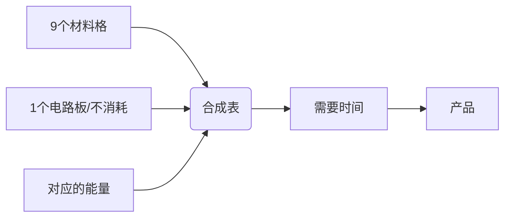

# 桶 Bruaket
A mod just hava bucket.  
一个桶mod  
Rua!

# 桶的功能 Function Of Bruaket
## 重要概念 Important Point
1. 没有GUI
2. 代替合成台合成
## 合成 Crafting

```

```
## 显示 Display

# 其他功能 Function Of Other

# 物品与方块 Item And Block
## 方块
1. 木桶 Wooden Barrel
2. 手提桶 Bucket
3. 铁桶 Iron Barrel
4. 活木桶 Livingwood Barrel
5. 地狱桶 Nether Barrel
6. 工匠桶 Tinkers Barrel
7. 外星桶 Energistics Barrel
8. 末影桶 Ender Barrel

## 物品
1. 石符咒 Stone Talisman
2. 火符咒 Fire Talisman
3. 木符咒 Wood Talisman
4. 金符咒 Iron Talisman
5. 水符咒 Water Talisman
6. 炎符咒 Ultra Flamma Talisman
7. 焱符咒 Maxima Flamma Talisman
