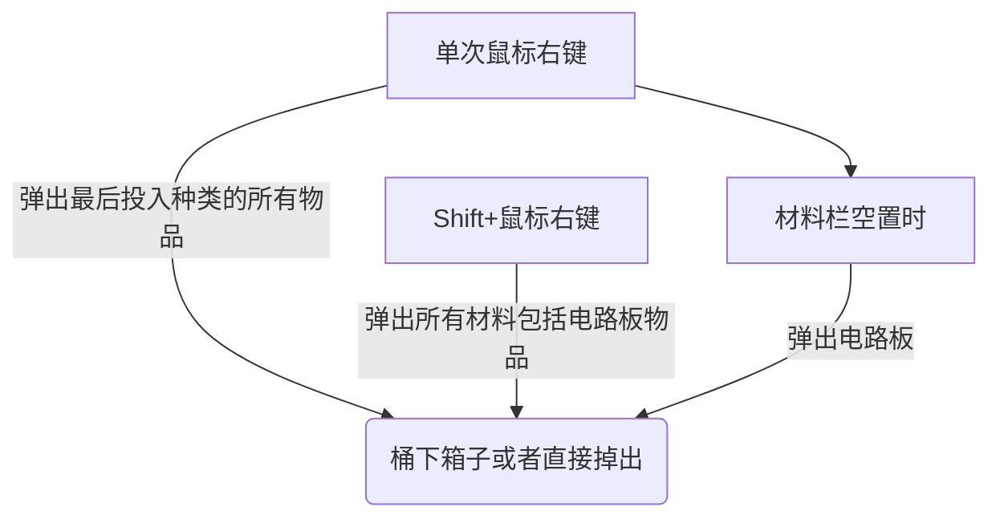

# 桶 Bruaket
A mod just hava bucket.  
一个**桶**mod  
Rua!

# 桶的功能 Function Of Bruaket
### 重要概念 Important point
1. 没有GUI
2. 代替合成台合成
### 合成 Crafting

1. 配方包含**9个材料格**和**一个电路板**以及**能量和时间**
2. 单次合成可以需求多个同种材料和生产多个产品
3. 支持RF，MANA
### 显示 Display
1. 在准心下方显示桶内合成状态
2. 九个物品框+一个电路板框+合成进度+成品
[可以先不做这个东西，交给waila或者the one probe]

### 弹出物品


### 电路板
用来区分合成表，虽然沿用格雷科技的叫法叫电路板，但是这里使用的物品是符咒（Talisman）。

### 物流 Logistics

感觉输出物品的功能可以完全做成一个模块重复使用，上面有多处使用输出物品。

### 其他 Other
1. 支持Waila
2. 支持The One Probe
3. 支持Crafttweaker注册合成表

```
推荐的代码框架展示:
桶.addRecipe(输出物品,输出数量,电路板,能量种类,能量消耗量,合成表JSON);
桶.addRecipe(输出物品,输出数量,电路板,能量种类,能量消耗量,
    {
    "物品名1-9": 数量
    }
);

或者看看能不能学一学GTCE的
```
[GTCE](https://docs.blamejared.com/1.12/zh/Mods/GregTechCE/Machines)
# 物品与方块 Item And Block
### 方块
1. 木桶 Wooden Barrel
2. 铁桶 Iron Barrel
3. 活木桶 Livingwood Barrel
4. 地狱桶 Nether Barrel
5. 工匠桶 Tinkers Barrel
6. 能源桶 Energistics Barrel
7. 末影桶 Ender Barrel

### 物品
1. 石符咒 Stone Talisman
2. 火符咒 Fire Talisman
3. 木符咒 Wood Talisman
4. 金符咒 Iron Talisman
5. 水符咒 Water Talisman
6. 炎符咒 Ultra Flamma Talisman
7. 焱符咒 Maxima Flamma Talisman
8. 手提桶 Bucket

# 物品功能
**木桶&铁桶&工匠**  
不消耗能量的合成桶  
**活木桶**  
消耗mana的合成桶  
**地狱桶**  
消耗能量代替熔炉的桶，放入不同符咒效果不同，可以消耗MANA  
1. 火符咒：单次烧制1个物品，运行一次消耗2000RF，功耗20/t
2. 炎符咒：单次烧制9个物品，运行一次消耗20000RF，功耗200/t
3. 焱符咒：单次烧制36个物品，运行一次消耗100000RF，功耗1000/t

**能源桶**  
能接入AE网络，可执行所有配方，如需要消耗能量则消耗1.5倍于原配方等比转换后的AE能量
*可以先不做这个*  
**末影桶**  
消耗RF的合成桶  
**手提桶**  
装备在戒指位置的合成桶，能执行所有木桶和铁桶配方  
*可以先不做这个*  
# 材质设计
1. 模型使用略瘦（xz轴窄）于原版标准方块的方块
2. 基础木桶可以表现的和竖置的酒桶一样的外观
3. 桶身正面有一个嵌入符文的位置，没嵌入时需要表现出有洞
4. 嵌入符文后材质变化

# 配置文件
1. 所有配方时间倍率
2. 所有配方能量倍率
3. 地狱桶各级能量总消耗设置
4. 地狱桶各级功率设置